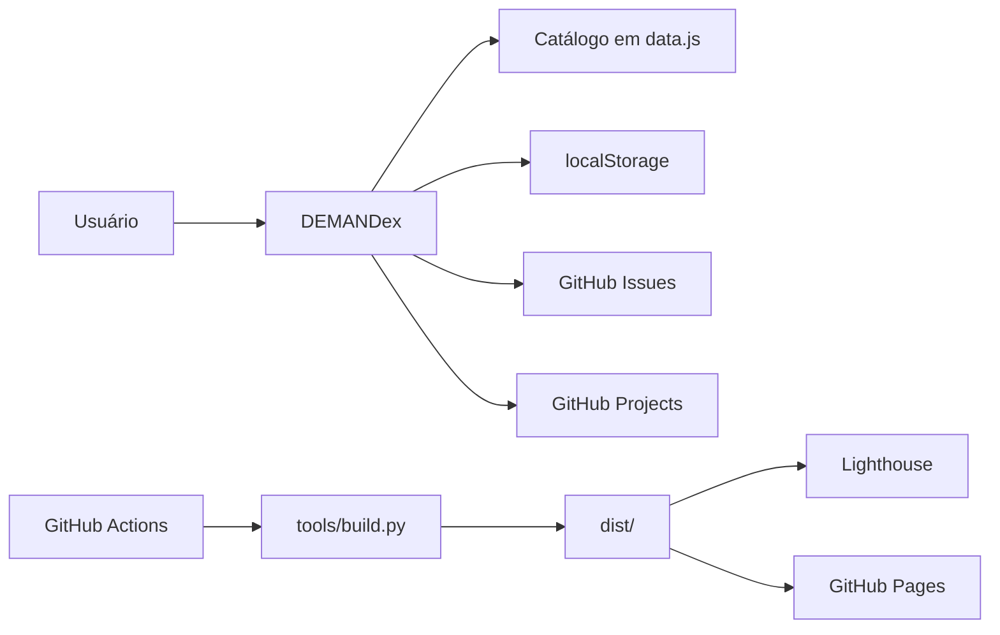

# Arquitetura técnica

## 1. Visão geral

O DEMANDex é uma aplicação **frontend estática**, sem backend próprio. A arquitetura utiliza HTML, CSS e JavaScript modular no navegador, com publicação como arquivos estáticos.

## 2. Camadas

### HTML

`html/index.html` contém a estrutura base da interface, incluindo:

- cabeçalho;
- área de equipes;
- controles de visualização;
- painel de configurações;
- abas de perfil, aparência e informações do produto.

### CSS

A camada visual é dividida em arquivos especializados:

- `css/style.tokens.css`: tokens e variáveis de design;
- `css/styles.base.css`: regras base;
- `css/styles.components.css`: componentes e layouts;
- `css/styles.animation.css`: animações e estados visuais;
- `css/theme-dark.css`: tema escuro;
- `css/theme-light.css`: tema claro;
- `css/theme-backgrounds.css`: variações estáticas de background;
- `css/styles.css`: agregação/entrada de estilos.

### JavaScript

A aplicação usa ES Modules nativos.

#### `js/script.js`

Ponto de entrada responsável por:

- criar o controlador do portal;
- preencher o seletor de equipes do perfil;
- restaurar perfil;
- restaurar aparência;
- restaurar visualização;
- conectar controles globais;
- carregar a versão do produto;
- iniciar animações;
- inicializar a busca rápida.

#### `js/modules/data.js`

Fonte central de configuração de:

- equipes;
- ícones SVG;
- cores;
- descrições;
- templates;
- categorias;
- URLs de GitHub Projects;
- URL-base de GitHub Issues;
- contexto de Qualidade.

#### `js/modules/dom.js`

Centraliza consultas de DOM e referências compartilhadas. Isso reduz consultas repetidas e desacopla os demais módulos dos seletores HTML.

#### `js/modules/portal.js`

Responsável pelo estado e renderização funcional do portal:

- geração dos cards;
- agrupamento de templates;
- abertura/fechamento de equipes;
- contexto de equipe e Qualidade;
- atualização do cabeçalho;
- acessibilidade dos painéis;
- controle de foco e visibilidade dos templates;
- persistência de favoritos e atualização dos badges de cada equipe.

#### `js/modules/command.js`

Implementa a busca rápida por equipes, templates e ações, com atalhos de teclado e itens recentes persistidos no navegador.

#### `js/modules/preferences.js`

Responsável por:

- leitura e persistência de preferências;
- paleta;
- fonte;
- textura;
- tamanho da textura;
- background estático;
- borda;
- emoji;
- hover 3D;
- perfil;
- painel de configurações;
- animações relacionadas à troca de aparência.

#### `js/modules/animations.js`

Responsável pelas animações baseadas em Web Animations API e pelos efeitos decorativos do portal.

## 3. Estado

Não existe store global externa. O estado é mantido por:

- variáveis internas dos módulos;
- atributos `data-*` no DOM;
- classes CSS;
- `localStorage` para preferências persistentes.

Também são persistidos localmente os favoritos de templates e os itens recentes da busca rápida.

## 4. Dependências de runtime

A aplicação publicada não depende de framework JavaScript nem de servidor de aplicação.

Dependências externas de runtime identificadas:

- GitHub Issues;
- GitHub Projects;
- GitHub Pages;
- Google Fonts, quando carregadas pela interface.

## 5. Dependências de build

O build utiliza:

- Python 3.12+;
- `rjsmin`;
- `rcssmin`.

O pipeline também utiliza Node.js 22 para executar o Lighthouse via `npx`.

## 6. Distribuição

`tools/build.py`:

1. percorre os diretórios `css/` e `js/`;
2. minifica arquivos preservando a estrutura relativa;
3. copia `assets/`;
4. lê `html/index.html`;
5. ajusta caminhos relativos para a raiz de `dist/`;
6. grava `dist/index.html`;
7. copia `VERSION`.

O resultado é uma distribuição estática independente da árvore de desenvolvimento.
